# Store Rating Platform

Full-stack web application that lets users rate stores (1–5 stars) with **three distinct roles**:**Admin**, **Normal User**, and **Store Owner**.

Built as a solution for the **FullStack Intern Coding Challenge**.

## 🚀 Live Demo

* **Frontend** (React + TypeScript): <https://ratingstore-1.onrender.com>
* **Backend API** (test with Postman): <https://ratingstore.onrender.com/api>

  \

**Quick test credentials** (created for reviewers):

| Role | Email | Password |
|----|----|----|
| Admin | admin@gmail.com | Roxiller@123 |
| Normal User | user@gmail.com | Roxiller@123 |
| Store Owner | store@gmail.com | Roxiller@123 |

> **==Note==**==: Render free tier apps sleep after inactivity. First load may take **10–40 seconds** to wake up.==

## Screenshots

All screenshots are from the **live deployed version**.

### Authentication

<p align="center">
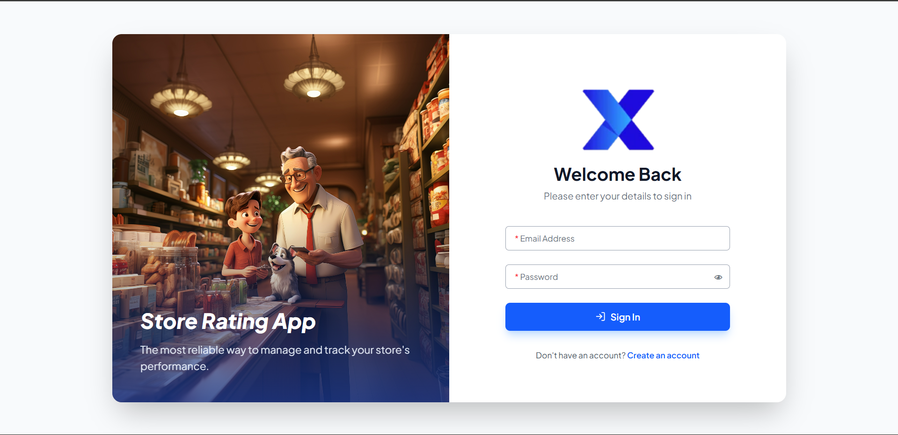
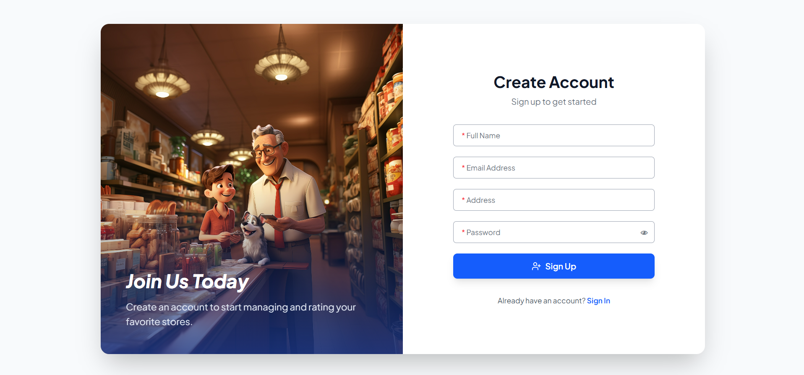
</p>

### Admin Experience

<p align="center">
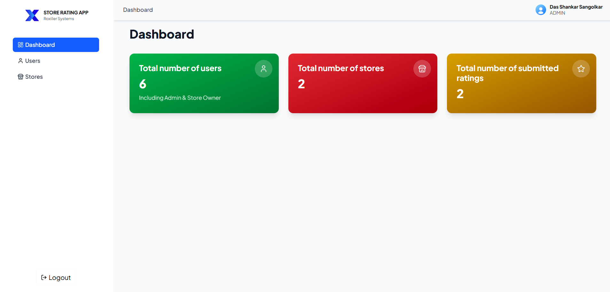
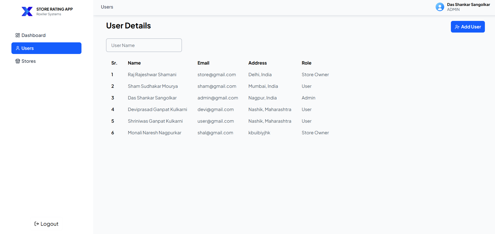
</p>

<p align="center">
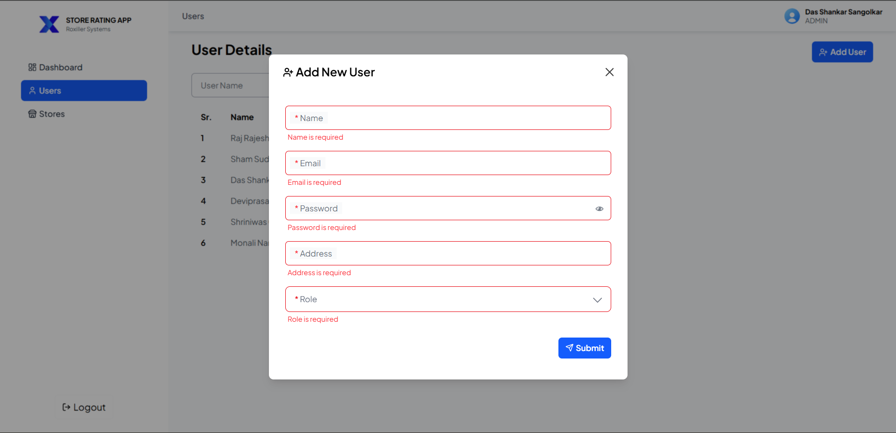
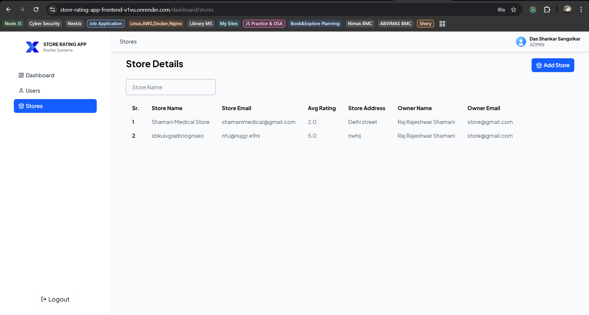
</p>

<p align="center">
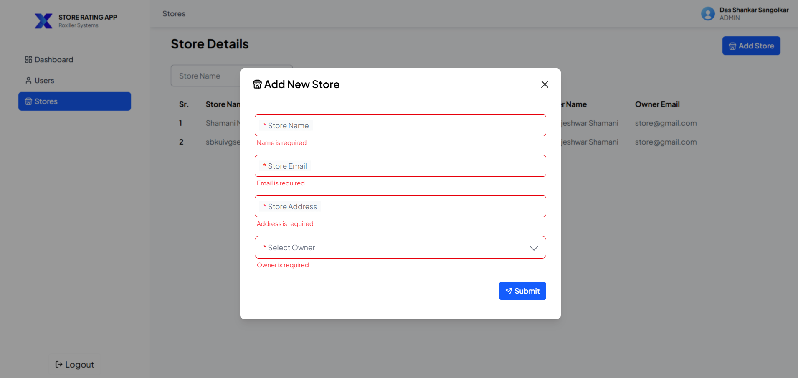
</p>

### Normal User Experience

<p align="center">
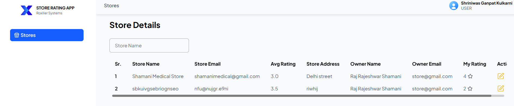
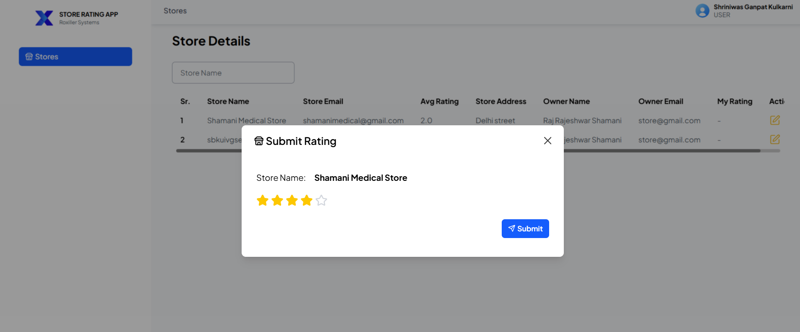
</p>

<p align="center">
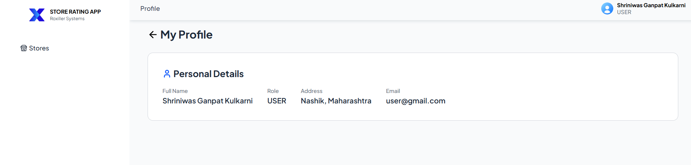
</p>

### Store Owner Experience

<p align="center">
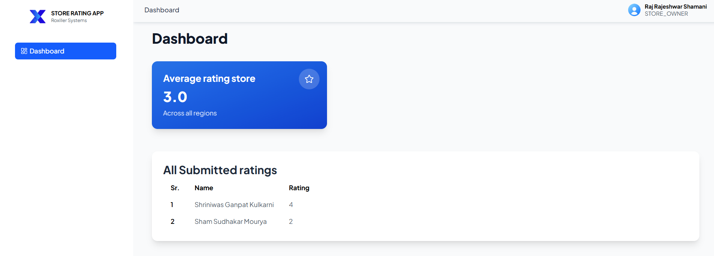
</p>

> Click images to enlarge. All screenshots captured February 2026 from live deployment.

## Tech Stack

**Backend**

* Node.js + Express.js
* MongoDB Atlas + Mongoose
* JWT Authentication + bcrypt hashing
* Role-based access control

**Frontend**

* React 18 + TypeScript
* Vite
* Tailwind CSS
* Axios + React Router v6
* State management: Redux Toolkit / Context
* UI: Custom components (FloatingInput, Table, Modal, StarRating)

**Deployment**

* Render (free tier) for both frontend & backend
* MongoDB Atlas (free tier)

## Features Implemented

* JWT-based authentication & role-based authorization
* **Admin** — create/list/filter users & stores, view total stats
* **Normal User** — search stores by name/address, submit/modify ratings, see own & average rating
* **Store Owner** — view average rating + list of users who rated their store
* Password update for all authenticated users
* Form validations (name 20–60 chars, password 8–16 + uppercase + special char, email, address ≤400)
* Search, sorting, toast notifications, responsive layout

## How to Run Locally

### Prerequisites

* Node.js ≥ 18
* MongoDB Atlas account (free tier)

### Backend

```bash
cd backend
cp .env.example .env          # fill MONGODB_URI & JWT_SECRET
npm install
npm start                     # → http://localhost:3000

**Frontend**

* React 18 + TypeScript
* Vite (or CRA)
* Tailwind CSS (or your styling solution)
* Axios for API calls
* React Router v6
* State: Redux Toolkit / Context (depending on what you used)

**Other**

* Environment variables (.env)
* Input validation (express-validator / zod / manual)
* Toast notifications (sonner)

## Features Implemented

* User registration & login (JWT)
* Role-based dashboards & access control
  * Admin: create users/stores, view stats, list & filter users/stores
  * Normal User: search & rate stores, see own & average ratings
  * Store Owner: see average rating & list of raters for their store
* Password update
* Search & sorting on listings
* Form validations (name 20–60 chars, password rules, email, address max 400)
* Responsive UI (basic)

## Project Structure

store-rating-app/
├── backend/           → Express API
├── frontend/          → React app
└── README.md

## How to Run Locally

### Prerequisites

* Node.js ≥ 18
* MongoDB (local or Atlas)

### Backend

```bash
cd backend
cp .env.example .env          # fill MONGODB_URI & JWT_SECRET
npm install
npm start           # runs on http://localhost:3000
```

### Frontend

```bash
cd frontend
cp .env.example .env          # fill VITE_API_URL=http://localhost:3000
npm install
npm run dev                   # runs on http://localhost:5173
```

## Project Structure

```bash
store-rating-app/
├── backend/           # Express + MongoDB + JWT
├── frontend/          # React + TypeScript + Vite
├── screenshots/       # All images used in README
├── .gitignore
└── README.md
```


